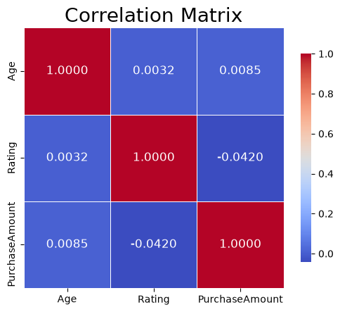
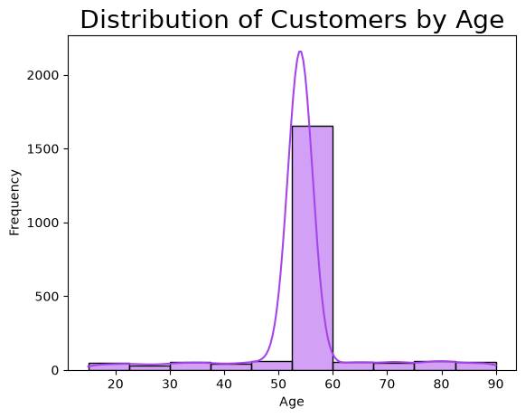
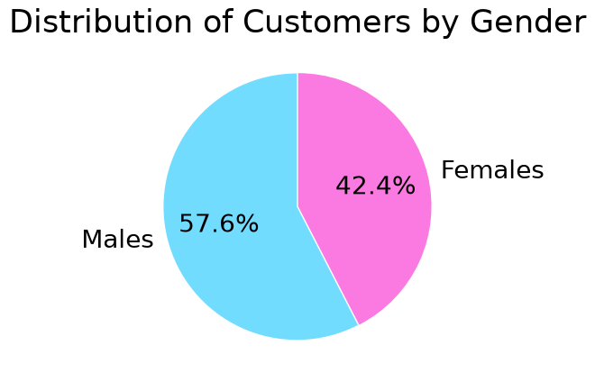
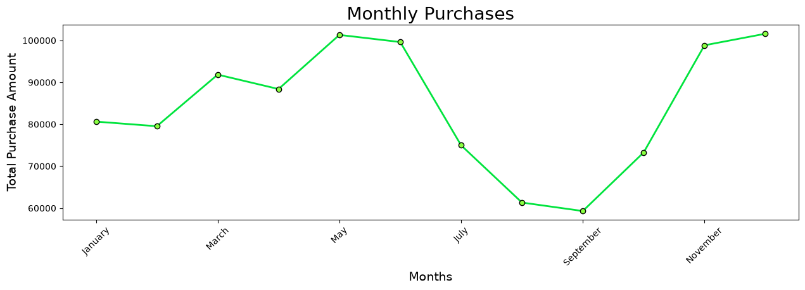
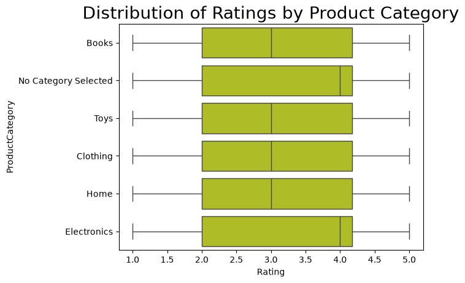
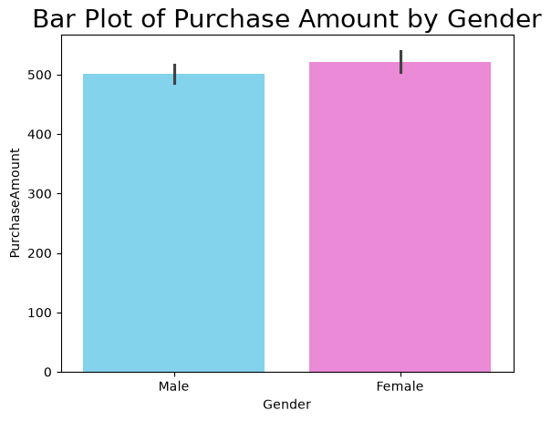
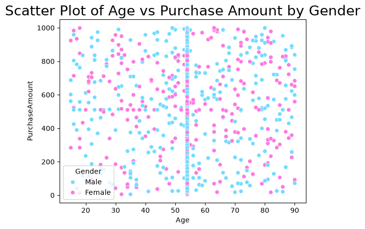

# Customer Data Cleaning & Exploratory Data Analysis

## Overview

This project demonstrates a complete data cleaning and exploratory data analysis (EDA) workflow using Python.

The dataset contains common data quality issues such as missing values, duplicate records, inconsistent formatting, and incorrect data types. The goal of this project is to clean the dataset, analyze it, and generate meaningful visualizations.

---

## Technologies Used

* Python
* Pandas
* NumPy
* Matplotlib
* Seaborn
* Jupyter Notebook

---

## Project Workflow

* Import the dataset
* Explore the data
* Remove duplicate records
* Handle missing values
* Standardize data formatting
* Correct data types
* Perform exploratory data analysis
* Create visualizations
* Export the cleaned dataset

---

## Sample Visualizations

### Correlation Heatmap



---

### Age Distribution



---

### Gender Distribution



---

### Monthly Purchases



---

### Product Category Distribution



---

### Purchase Amount Distribution



---

### Age vs Purchase Amount



---

## Project Structure

```text
customer-data-cleaning-analysis/
│
├── data/
├── images/
├── notebook/
├── README.md
└── requirements.txt
```

---

## Author

Ayman ECH-TAIBABI - Data Engineering student at EST Agadir
